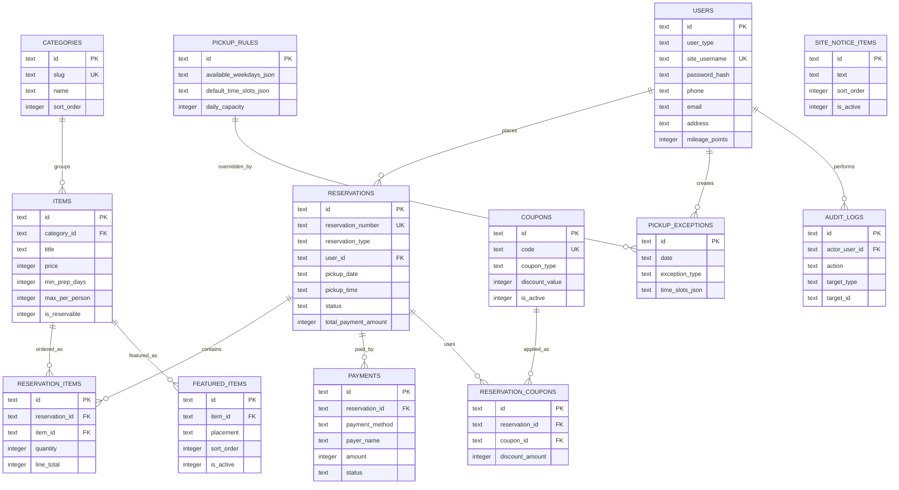

# Database Plan

## Principles

- D1 SQLite를 기준으로 작게 시작하되, 예약/결제/운영 설정의 경계를 분리합니다.
- 가격, 메뉴명, 픽업 정보는 예약 시점 snapshot을 저장해 나중에 메뉴가 바뀌어도 영수증이 흔들리지 않게 합니다.
- 비회원도 `users`에 `guest` 타입으로 저장해 예약과 결제의 참조 구조를 단순하게 유지합니다.
- 비밀번호는 평문 저장 금지입니다. Worker에서 hash 후 `password_hash`만 저장합니다.
- 사진 파일은 R2에 저장하고 DB에는 `image_key` 또는 외부 URL만 저장합니다.
- R2는 private bucket으로 두고, R2 object metadata와 월별 안전 한도 ledger를 D1에 저장합니다.

## Status Values

```txt
user_type: member, guest, admin
reservation_type: guest, member
reservation_status: payment_pending, payment_confirmed, making, pickup_ready, picked_up, cancelled
payment_method: bank_transfer
payment_status: payment_pending, payment_confirmed, refund_pending, refunded, cancelled
coupon_type: fixed_amount, percent
pickup_exception_type: unavailable, custom_hours
r2_object_status: active, deleted
r2_usage_event_status: reserved, success, failed, blocked, synced
```

## Core Tables

### `users`

회원과 비회원 예약자를 모두 담습니다. 비회원은 `user_type=guest`, `site_username`과 `password_hash`는 `NULL`입니다.

| Column | Type | Notes |
| --- | --- | --- |
| id | text | primary key, `usr_...` or `gst_...` |
| user_type | text | member, guest, admin |
| site_username | text | nullable unique, login id |
| password_hash | text | nullable, encrypted/hash only |
| name | text | reserver name |
| phone | text | required |
| email | text | required |
| address | text | required |
| is_phone_verified | integer | boolean |
| is_email_verified | integer | boolean |
| mileage_points | integer | default 0 |
| joined_at | text | member signup time, nullable for guest |
| last_login_at | text | nullable |
| created_at | text | ISO datetime |
| updated_at | text | ISO datetime |

### `categories`

메뉴 카테고리 리스트입니다.

| Column | Type | Notes |
| --- | --- | --- |
| id | text | primary key, `cat_...` |
| slug | text | unique |
| name | text | display name |
| description | text | nullable |
| sort_order | integer | display order |
| is_active | integer | boolean |
| created_at | text | ISO datetime |
| updated_at | text | ISO datetime |

### `items`

판매 메뉴입니다. `total_limited_quantity`는 전체 기간 기준 한정수량, 날짜별 제한은 이후 `item_inventory_overrides`로 확장 가능합니다.

| Column | Type | Notes |
| --- | --- | --- |
| id | text | primary key, `itm_...` |
| category_id | text | references categories.id |
| title | text | item title |
| slug | text | unique |
| image_key | text | R2 object key, nullable |
| image_url | text | external/static URL fallback |
| description | text | menu detail |
| is_seasonal | integer | boolean |
| price | integer | KRW |
| min_prep_days | integer | minimum preparation days |
| max_per_person | integer | per-user/order cap |
| total_limited_quantity | integer | nullable for unlimited |
| remaining_limited_quantity | integer | nullable |
| is_reservable | integer | boolean |
| sort_order | integer | display order |
| registered_at | text | admin registration timeline |
| created_at | text | ISO datetime |
| updated_at | text | ISO datetime |

### `reservations`

예약의 머리글입니다. 상태별 timeline 컬럼을 명시적으로 둬서 admin table에서 빠르게 표시합니다.

| Column | Type | Notes |
| --- | --- | --- |
| id | text | primary key, `rsv_...` |
| reservation_number | text | unique customer-facing number |
| reservation_type | text | guest, member |
| user_id | text | references users.id |
| pickup_date | text | YYYY-MM-DD |
| pickup_time | text | HH:mm |
| request_note | text | customer memo |
| status | text | payment_pending, payment_confirmed, making, pickup_ready, picked_up, cancelled |
| total_item_amount | integer | before discounts |
| discount_amount | integer | default 0 |
| total_payment_amount | integer | server-calculated |
| payment_pending_at | text | nullable |
| payment_confirmed_at | text | nullable |
| making_started_at | text | nullable |
| pickup_ready_at | text | nullable |
| picked_up_at | text | nullable |
| cancelled_at | text | nullable |
| created_at | text | ISO datetime |
| updated_at | text | ISO datetime |

### `reservation_items`

예약에 담긴 각 메뉴입니다.

| Column | Type | Notes |
| --- | --- | --- |
| id | text | primary key, `rsi_...` |
| reservation_id | text | references reservations.id |
| item_id | text | references items.id |
| item_title_snapshot | text | preserve historical title |
| item_image_key_snapshot | text | nullable |
| unit_price_snapshot | integer | preserve historical price |
| quantity | integer | ordered quantity |
| line_total | integer | unit price * quantity |
| created_at | text | ISO datetime |

### `payments`

현재 결제수단은 계좌이체만 둡니다. 입금자 정보와 상태 timeline을 저장합니다.

| Column | Type | Notes |
| --- | --- | --- |
| id | text | primary key, `pay_...` |
| reservation_id | text | references reservations.id |
| payment_method | text | bank_transfer |
| payer_name | text | depositor name |
| payer_phone | text | nullable |
| bank_name | text | admin receiving bank, nullable |
| bank_account_last4 | text | nullable |
| amount | integer | KRW |
| status | text | payment_pending, payment_confirmed, refund_pending, refunded, cancelled |
| payment_pending_at | text | nullable |
| payment_confirmed_at | text | nullable |
| refund_pending_at | text | nullable |
| refunded_at | text | nullable |
| cancelled_at | text | nullable |
| admin_note | text | nullable |
| created_at | text | ISO datetime |
| updated_at | text | ISO datetime |

### `coupons`

쿠폰 정의입니다.

| Column | Type | Notes |
| --- | --- | --- |
| id | text | primary key, `cpn_...` |
| code | text | unique |
| title | text | display title |
| coupon_type | text | fixed_amount, percent |
| discount_value | integer | KRW or percent |
| min_order_amount | integer | default 0 |
| max_discount_amount | integer | nullable |
| starts_at | text | nullable |
| ends_at | text | nullable |
| usage_limit_total | integer | nullable |
| usage_limit_per_user | integer | nullable |
| used_count | integer | default 0 |
| is_active | integer | boolean |
| created_at | text | ISO datetime |
| updated_at | text | ISO datetime |

### `reservation_coupons`

예약에 적용된 쿠폰 snapshot입니다.

| Column | Type | Notes |
| --- | --- | --- |
| id | text | primary key, `rsc_...` |
| reservation_id | text | references reservations.id |
| coupon_id | text | references coupons.id |
| code_snapshot | text | preserve historical code |
| discount_amount | integer | KRW |
| created_at | text | ISO datetime |

## Admin Operation Tables

### `pickup_rules`

운영자가 설정하는 기본 픽업 가능 요일과 기본 시간입니다.

| Column | Type | Notes |
| --- | --- | --- |
| id | text | primary key, usually `default` |
| available_weekdays_json | text | JSON array, 0 Sun - 6 Sat |
| default_time_slots_json | text | JSON array of HH:mm |
| daily_capacity | integer | nullable |
| is_active | integer | boolean |
| created_at | text | ISO datetime |
| updated_at | text | ISO datetime |

### `pickup_exceptions`

특정 날짜 또는 시간의 픽업 불가능/커스텀 시간을 저장합니다.

| Column | Type | Notes |
| --- | --- | --- |
| id | text | primary key, `pex_...` |
| date | text | YYYY-MM-DD |
| exception_type | text | unavailable, custom_hours |
| time_slots_json | text | nullable JSON array for custom_hours |
| reason | text | nullable admin note |
| created_by_user_id | text | nullable references users.id |
| created_at | text | ISO datetime |
| updated_at | text | ISO datetime |

### `site_notice_items`

사이트 상단에 흐르는 텍스트 리스트입니다.

| Column | Type | Notes |
| --- | --- | --- |
| id | text | primary key, `not_...` |
| text | text | notice copy |
| icon_label | text | optional emoji/text label |
| href | text | nullable |
| sort_order | integer | display order |
| starts_at | text | nullable |
| ends_at | text | nullable |
| is_active | integer | boolean |
| created_at | text | ISO datetime |
| updated_at | text | ISO datetime |

### `featured_items`

메인/대시보드에 보이는 대표 메뉴 리스트입니다.

| Column | Type | Notes |
| --- | --- | --- |
| id | text | primary key, `fit_...` |
| item_id | text | references items.id |
| placement | text | home, dashboard |
| title_override | text | nullable |
| description_override | text | nullable |
| sort_order | integer | display order |
| starts_at | text | nullable |
| ends_at | text | nullable |
| is_active | integer | boolean |
| created_at | text | ISO datetime |
| updated_at | text | ISO datetime |

### `audit_logs`

관리자 변경 이력입니다.

| Column | Type | Notes |
| --- | --- | --- |
| id | text | primary key, `aud_...` |
| actor_user_id | text | nullable references users.id |
| action | text | e.g. item.updated |
| target_type | text | item, reservation, pickup_exception |
| target_id | text | target id/date |
| payload_json | text | small JSON snapshot |
| created_at | text | ISO datetime |

## ERD



## Migration Strategy

- `worker/db/migrations` SQL files are the source of truth for D1.
- `created_at` and `updated_at` are ISO strings generated by Worker services.
- Use `CHECK` constraints for status enums where practical.
- Avoid destructive migration after real reservations exist.
- Add indexes for login lookup, reservation lookup, pickup date filtering, and admin list screens.
